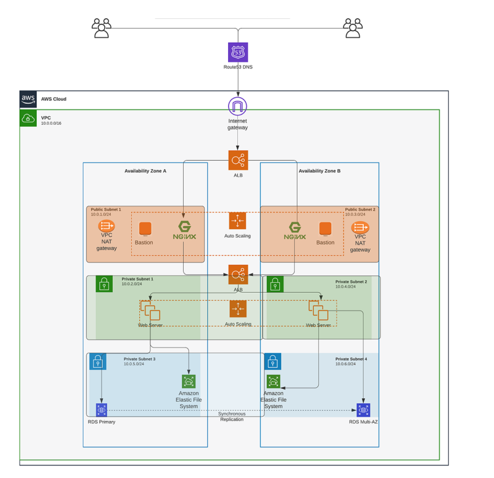

# 3TierIaC

## Part 1 
### Networking (creating these resources)
- vpc
- 2 public subnets
- 4 private subnets
- nat gateway
- eip (elastic ip)
- route tables for private & public subnets
- route for public subnets
- route table association for private & public

## Part 2 
### Networking
- i'm identity and access mangement
- security groups for (load balancers, webserver, datalayer, bastion hosts and nginx reverse proxy)
- certification 
- creating load balancer.

### read about 
- length 
- element
- cidrsubnet
- format
- tags
- merge
- count
- for_each
