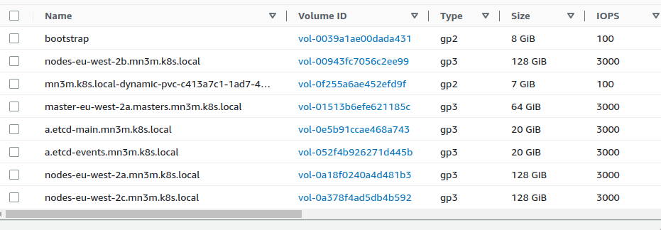

# Microservice Application 
- **Transport vehicles trackers microservice app**.

## what i will try to build?
- i will use **k8s** to handle the microservice app.
- microservice Application will be run on AWS cloud provider using **kops**. 
- build logging system for the app using **elk stack**. 
- build monitoring system for the app using **prometheus && grafana**. 
- build alerting system integrate with **slack**.


## K8S on cloud 
- we will use tool like [Kops](https://kops.sigs.k8s.io/) to build our k8s cluster on AWS.
##### configure EC2
- we need to launch EC2 instance, congigure it and make it like my **boot strap** server for my cluster.
   - **boot strap** has linux 2 ami. 
   - has 8Gi hard drive.
   - has ssh key **download it && keep it in safe place** and allow port 22 in **security group**
##### connecting to server
- ssh to machine 
  - you can use console to connect or your terminal, i prefer second so i will go with it.
```bash
#prefer to be in the folder you download ssh key in it
chmod 400 yourkey.pem # for security purpose
ssh -i youKey.pem ec2-user@IPOFMACHINE
```
##### installing kops
- install kops for you linux distro
```bash
curl -Lo kops https://github.com/kubernetes/kops/releases/download/$(curl -s https://api.github.com/repos/kubernetes/kops/releases/latest | grep tag_name | cut -d '"' -f 4)/kops-linux-amd64
chmod +x kops
sudo mv kops /usr/local/bin/kops
```
- install kubectl to connect with your cluster after building it. use this [link](https://kubernetes.io/docs/tasks/tools/install-kubectl-linux/)
##### do another configuration
- use this [link](https://kops.sigs.k8s.io/getting_started/aws/), follow steps to make **group, i'm user, configure your aws inside machine, make exports and so on**
##### create cluster 
```bash
# i choose to run my cluster in london (eu-west-2)
kops create cluster --zones eu-west-2a,eu-west-2b,eu-west-2c ${NAME}
# give ok to start implementing
kops update cluster --name ${NAME} --yes --admin
# check if cluster is ok or not.
kops validate cluster
```
##### some resources kop will create




##### provisioning our microservice application
- you will find code [here](https://github.com/DickChesterwood/k8s-fleetman) 
- Go to **manifest** folder deploy manifest by this order.
  - storage.yaml
  - mongo-stack.yaml
  - workload.yaml
  - services.yaml
- to check if everything is ok? run 
```bash
kubectl get all
```
- you will see these resources created

  
- use the **external ip for svc webapp** and voila your microservice app is working.


## logging (elk stack)
### we will use the elk stack 

- elastic search -> search and analytics engine.
- logstash or fluentd -> gather logs from nodes.
- kibana -> to Visualize data.
### setup the elk stack 
- we will use files(fluentd and elastic stack) from manifest folder.
```bash
kubectl apply -f fluentdservice.yaml
kubectl apply -f elastic-stack.yaml
```
- to see our resources 
```bash
kubectl get pod -n kube-system
```

- to acces our logging dashboard we need to make kibana svc has a type of load balancer.
- to see svc 
```bash
kubectl get svc -n kube-system
```


```bash
kubectl edit svc kibana-logging -n kube-system
# change type from *ClusterIP* to *LoadBalancer*
```
- then i can access it using the dns on the load balancer.

## Monitoring
### we will use [grafana](https://grafana.com/) && [prometheus](https://prometheus.io/)

### setup monitoring stack
- we will use *Helm*, [Helm](https://helm.sh/) is a package manager for kubernetes. install it and check if it runs or not 
```bash
helm version
```

- go to [artifact hub](https://artifacthub.io/), search for [prometheus stack](https://artifacthub.io/packages/helm/prometheus-community/kube-prometheus-stack)
- go to your *bootstrap machine* and add theser commands
```bash
helm repo add prometheus-community https://prometheus-community.github.io/helm-charts
helm repo update
# before install the chart we need to make *Namespace for this stack*
kubectl create ns monitoring
# then install chart
helm install monitoring-stack prometheus-community/kube-prometheus-stack -n monitoring
```
- all resources after installing helm chart in monitoring namespace.

```bash
kubectl get all -n monitoring
```


- we need to access the dashboard for grafana, so we need to edit svc *monitoring-stack-grafana*.

```bash
kubectl edit svc monitoring-stack-grafana -n monitoring
# change type: ClusterIP to type: LoadBalancer
```
- after that, take the external ip of svc monitoring-stack-grafana put in browser.
- it will ask for user {**admin**} and password {**prom-operator**}, you find it in this [link](https://artifacthub.io/packages/helm/prometheus-community/kube-prometheus-stack?modal=values&path=grafana.adminPassword), just search for it

- take a tour! 
- i will show you the sample of workload on the nodes in k8s cluster.


## Alerting manager
### i need to handle the alert i recieve from my monitoring stack.
#### slack config
- so we will integrate with [slack](https://slack.com/), just make a workspace, make alert **channel** to recieve alert on it.
- go to **apps** from setting and search for **webhook** click add.

- you will have **webhook api** just like that **https://hooks.slack.com/services/T08888KT27/BBJ5T/Y88888888888wo8RND**.
- to test it we will use this upload.
```bash
url -X POST --data-urlencode "payload={\"channel\": \"#alert\", \"username\": \"webhookbot\", \"text\": \"This is posted to #alert and comes from a bot named webhookbot.\", \"icon_emoji\": \":ghost:\"}" https://hooks.slack.com/services/T089348590327/8888888888/888888888888
```
- you will see this 


#### cluster config
- we will use this [link](https://prometheus.io/docs/alerting/latest/configuration/#slack_config) to write the config file for **alertmanager.yaml** you will find it in **manifest** folder.
- to handle the request to webhook api, we will make a secret using the alertmanager file.
```bash
# first delete secret that have been used
kubectl delete secret -n monitoring alertmanager-monitoring-stack-kube-prom-alertmanager
# second create secret using our file
kubectl create secret -n monitoring generic alertmanager-monitoring-stack-kube-prom-alertmanager --from-file=alertmanager.yaml
```
- to check that we do well, you will see alerts in you slak channed start to appear.


## End
